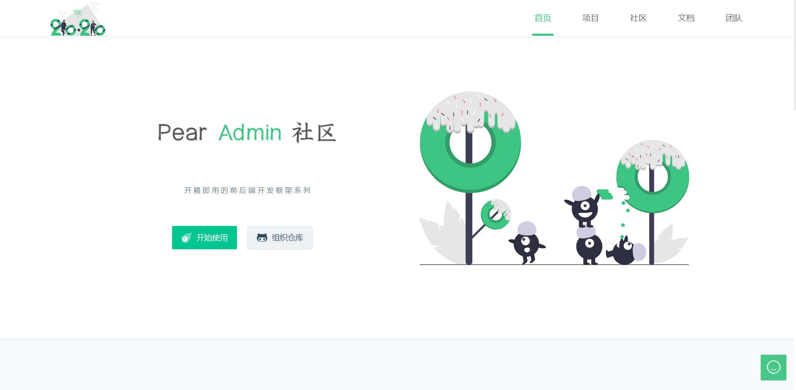

## 项目介绍  :id=start

欢迎阅读 Pear Admin Flask 的开发文档！Pear Admin Flask 是一个基于 Flask 的后台管理系统，拥抱应用广泛的 Python 语言，通过使用本系统，即可快速构建你的功能业务。

项目旨在为 Python 开发者提供一个后台管理系统的模板，成为您构建信息管理系统、物联网后台等应用时灵活、简单的工具。

同时，Pear Admin Flask 项目也是一个对于 Python 初学者友好的项目。此项目处于开发初期，欢迎各位 Python 爱好者加入到 Pear Admin Flask 项目建设中来。如果您在使用此项目的过程中，发现项目代码存在问题，请在 Gitee 上提交 PR ，一起开源共建！

接下来，我们将会为您详细介绍该项目搭建方法与开发架构。

> **请注意：**Pear Admin Flask 项目有三个分支，请在阅读文档时，请注意辨别不同分支。

**[master分支版本](https://gitee.com/pear-admin/pear-admin-flask/tree/master/)**

flask 2.0.1 +	flask-sqlalchemy + 权限验证 + Flask-APScheduler 定时任务 + marshmallow 序列化与数据验证

master 分支为主分支，是功能最全、页面最多的分支。

**[mini 分支版本](https://gitee.com/pear-admin/pear-admin-flask/tree/mini/)**

flask 2.0.1 + flask-sqlalchemy + 权限验证 + flask-restful

此版本主要是提供一个最个简的 pear admin flask 快速开发的模板，可以帮助用户快速搭建一个后台管理系统。
因为一些历史问题，例如 flask-restful 不再继续更新等，此版本不会也再继续更新，而会将精力投入到 main 分支当中去。

如果想使用这个分支进行开发，可以看 https://www.bilibili.com/video/BV1FF411b7bS 进行学习。

**[main 分支版本](https://gitee.com/pear-admin/pear-admin-flask/tree/main/)**

main 分支是对 mini 分支的后续，目前还在开发中。

## 下载使用  :id=download

#### 1. 官网地址

官网提供稳定版本的 Release 发行版本 [前往](http://www.pearadmin.com)

#### 2. 源码仓库

如果你需要最新代码，请前往 Gitee 仓库 [前往](https://gitee.com/pear-admin/pear-admin-flask)

如果您完成了这一步，请参阅[下载安装](install/)章节。

